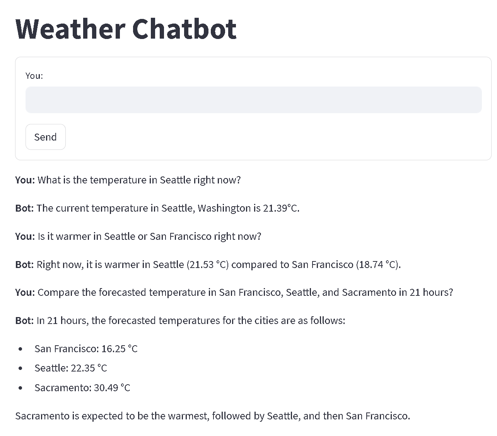
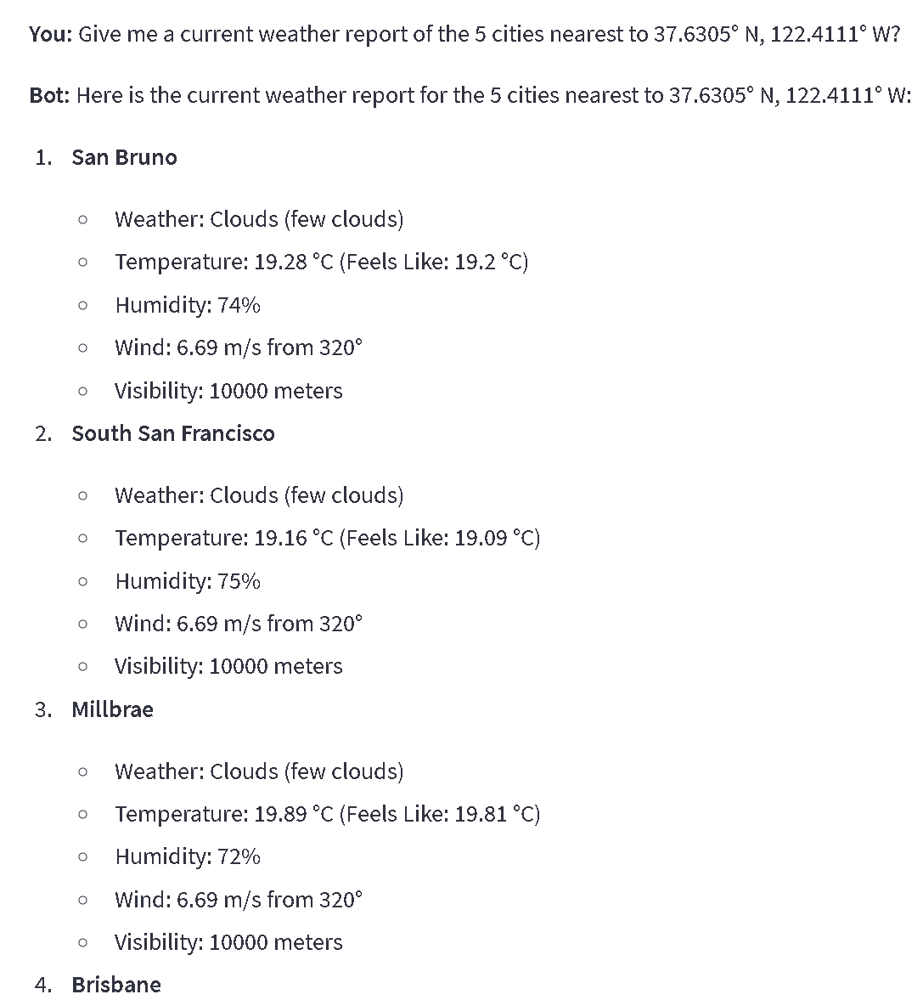
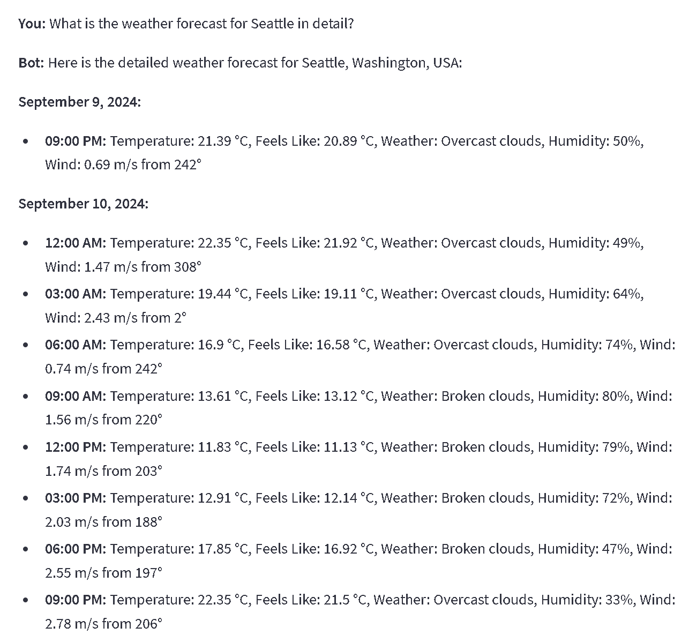

# Weather Chatbot

A weather chatbot built using **Llamaindex** and **OpenWeatherMap APIs**. This chatbot is capable of answering questions about the weather, comparing forecasts, and finding the closest cities to specified coordinates. It runs locally on your machine using **Streamlit**.

## Features
- City Weather Queries: Get the current weather for any city by name.
- Coordinate-Based Weather: Retrieve weather information based on geographic coordinates (latitude, longitude).
- Weather Forecasting: Provides a detailed 5-day forecast with 3-hour intervals using OpenWeatherMap API.
- Weather Comparison: Compare the weather between multiple cities.
- Nearest Cities Search: Find the closest cities to a given set of geographic coordinates.
- Geocoding/Reverse Geocoding: Convert between city names and geographic coordinates.
- Flexible Data Access: Leverage a CSV of cities for efficient querying, enabling fast, localized intermediate processing and responses.

## Tools Included
1. **Geography**: This tool uses the `PandasQueryEngine` to interact with a CSV file of cities supported by OpenWeather. The LLM infers data frame operations to retrieve the result.  
   **⚠️ Warning**: This tool allows the LLM access to the `eval` function, which can lead to arbitrary code execution on the machine running this tool. Use with caution.
   
2. **Closest_cities**: This tool returns the nearest cities along with their latitude and longitude based on the provided coordinates.

3. **OpenWeatherMap API Tools**:
   - [`current_weather`](https://openweathermap.org/current): Retrieves the current weather for a set of coordinates.
   - [`Day5_hour3_forecast`](https://openweathermap.org/forecast5): Provides a 5-day weather forecast for a set of coordinates with 3-hour intervals.
   - [`geocoding` and `reverse_geocoding`](https://openweathermap.org/api/geocoding-api): Converts between geographic coordinates and city names.

## Setup

1. Clone the repository.
  
2. Create a file named `creds` and add the following keys:
   - `open_ai_key`: Your OpenAI API key.
   - `OpenWeatherMap API key`: Your OpenWeatherMap API key.
   - `csv_filepath`: The path to the `merged_locations.csv` file.
   
   Example `creds` file:
   ```
   open_ai_key=YOUR_OPENAI_API_KEY
   OpenWeatherMap API key=YOUR_OPENWEATHER_API_KEY
   csv_filepath=./data/merged_locations.csv
   ```

3. Run the Streamlit application.
   ```bash
   streamlit run main.py
   ```

## Static Data Sources

- City list from OpenWeatherMap: [city_list](https://bulk.openweathermap.org/sample/)
- Country codes: [country_codes](https://github.com/rmosolgo/countrysaurus/blob/master/public/data/country_codes.csv)

These data sources were merged and cleaned to create the `merged_locations.csv` file, which the chatbot uses to answer location-based weather questions.

## Example Screenshots
Here are some screenshots of the chatbot in action:





## License
[MIT License](./LICENSE)

Feel free to contribute to the project and enhance the chatbot's capabilities!
